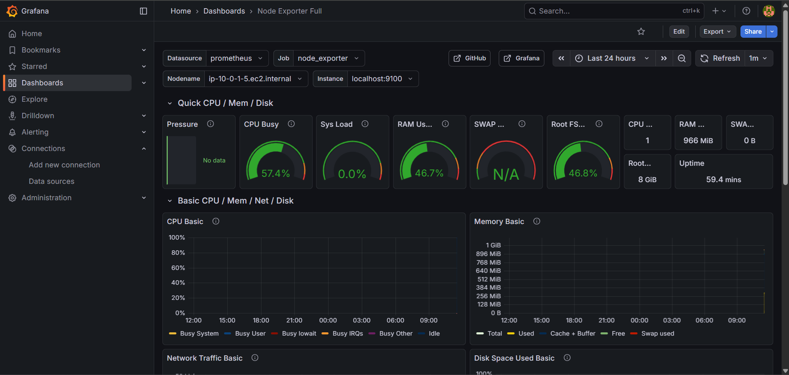

# Terraform-Based AWS Observability Stack with Prometheus & Grafana
## Project Overview
- This project demonstrates how to build a robust, observable, and production-ready AWS infrastructure using Infrastructure as Code (IaC) with Terraform, deploy a containerized Flask application, and implement end-to-end monitoring using Prometheus, Node Exporter, and Grafana.
- The goal of this project is to showcase real-world DevOps skills including:
- Automated cloud infrastructure provisioning
- Secure application deployment using Docker & ECR
- Host-level monitoring and observability
- Troubleshooting, debugging, and infrastructure consistency
This project is designed to reflect industry-standard DevOps practices used in modern cloud environments.

## Architecture Overview
AWS Components
- VPC with public subnet
- Internet Gateway and route table
- EC2 (t2.micro) running Docker containers
- Security Groups with restricted SSH and application ports
- IAM Role & Instance Profile for secure ECR access
- Elastic Container Registry (ECR) for application images

Monitoring Stack
- Node Exporter → Collects host-level metrics
- Prometheus → Scrapes metrics from Node Exporter
- Grafana → Visualizes metrics via dashboards

## Project Structure
```
terraform-aws-observability/
├── app/
│   ├── app.py
│   └── Dockerfile
├── terraform/
│   ├── main.tf
│   ├── variables.tf
│   ├── outputs.tf
│   └── user-data.sh
├── prometheus/
│   └── prometheus.yml
├── grafana/
│   ├── dashboards/
│   │   └── ec2-overview.json
│   └── datasources/
│       └── prometheus.yml
├── docker-compose.yml
├── .env.example
└── README.md
```

# Prerequisites
- AWS Account
- Terraform ≥ 1.x
- Docker & Docker Compose
- AWS CLI configured with credentials
- Git

## AWS Credentials Setup
Configure AWS credentials locally (do not hardcode):
```
aws configure
```
Or using environment variables:
```
export AWS_ACCESS_KEY_ID=XXXX
export AWS_SECRET_ACCESS_KEY=XXXX
export AWS_DEFAULT_REGION=us-east-1
```

## Infrastructure Provisioning (Terraform)
Initialize Terraform
```
cd terraform
terraform init
```
Apply Infrastructure
Replace MY_PUBLIC_IP with your actual IP address:
```
terraform apply -var="my_ip=MY_PUBLIC_IP/32"
```
Terraform Outputs
After apply, Terraform outputs:
- EC2 Public IP
- ECR Repository URL

## Application Containerization & Deployment
### Build Docker Image Locally
```
docker build -t flask-app:local ./app
```
### Authenticate Docker with ECR
```
aws ecr get-login-password --region us-east-1 \
| docker login --username AWS --password-stdin <ACCOUNT_ID>.dkr.ecr.us-east-1.amazonaws.com
```
### Tag & Push Image to ECR
```
docker tag flask-app:local <ECR_REPO_URL>:latest
docker push <ECR_REPO_URL>:latest
```
### Run Application on EC2
The EC2 instance pulls the image from ECR and runs it using Docker.
Verify:
```
curl http://<EC2_PUBLIC_IP>/
curl http://<EC2_PUBLIC_IP>/health
```
Expected response:
```
OK
```

## Monitoring & Observability
### Node Exporter
- Runs on port 9100
- Collects CPU, memory, disk, network, uptime metrics

### Prometheus
- Scrapes Node Exporter metrics every 15 seconds
- Available on port 9090

### Grafana
- Runs on port 3000
- Uses Prometheus as a data source
- Visualizes metrics using dashboards

## Grafana Dashboard
The Node Exporter Full dashboard is used to visualize EC2 metrics.
### Metrics Displayed:
- CPU Utilization
- Memory Usage
- Disk I/O
- Network Traffic
- Load Average
- Uptime

### Grafana Dashboard – EC2 Host Metrics



## Local Monitoring Stack (Docker Compose)
For local development and testing, the monitoring stack can be run using Docker Compose.
### Start Stack
```
docker-compose up -d
```
Services
- Prometheus → http://localhost:9090
- Grafana → http://localhost:3000
- Node Exporter → http://localhost:9100/metrics
Health Checks
All services include Docker health checks to ensure reliability.

## Security & Best Practices
- No hardcoded AWS credentials
- IAM role used instead of access keys on EC2
- SSH access restricted to specific IP
- Infrastructure fully defined via Terraform
- Logs written to stdout for easy inspection
- Health checks for application and monitoring stack

## Challenges Faced & Solutions
1. Docker Permission Issues on EC2

Solution: Used sudo and IAM-based ECR authentication

2. Prometheus API Timeout

Solution: Opened port 9090 via Terraform security group

3. Docker-Compose Bind Mount Error (WSL)

Solution: Corrected prometheus.yml from directory to file

## Key Learnings
- Practical Terraform infrastructure design
- Secure AWS container workflows using ECR & IAM
- Real-world monitoring stack implementation
- Debugging networking, permissions, and Docker issues
- Writing reproducible, production-ready IaC

## Cleanup (Important)
To avoid AWS charges:
```
cd terraform
terraform destroy
```
## Final Status
- All core requirements completed
- Infrastructure automated via Terraform
- Application deployed and accessible
- Monitoring fully functional
- Local development stack provided

## Author
Bharghav Sai Marla
DevOps | Cloud | AWS | Terraform | Kubernetes
